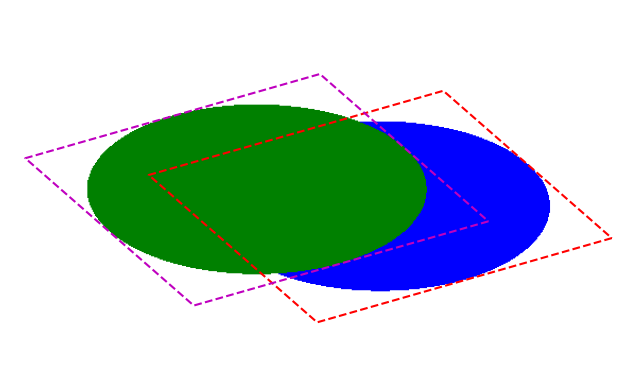

## 3Dgaussian2ellipsis

`3D Gaussian Splatting` has emerged as a powerful framework for novel 
view synthesis. 3D Gaussians are splatted to the defined by camera parameters image
plane and the gaussian primitives are optimized as described in [GS](https://github.com/graphdeco-inria/gaussian-splatting). Concerning
the spaltting procedure and the alpha decomposition of the employed Gaussians we are able 
to visualize the outcome but not the topology of the splatted Gaussians. That is why we created 
this useful tool in `moderngl` to facilitate `2D splatted Gaussians/ellipses` visualization on the image plane.


## Installation
```
conda create --name ellipsis python=3.10
conda install pytorch==2.4.0 torchvision==0.19.0 torchaudio==2.4.0 pytorch-cuda=12.4 -c pytorch -c nvidia
pip install moderngl==5.12.0
pip install matplotlib
```
In case you encounter the followuing error

```
libGL error: MESA-LOADER: failed to open swrast: /home/your_username/anaconda3/envs/ellipsis/lib/python3.10/site-packages/numpy/_core/../../../../libstdc++.so.6: version `GLIBCXX_3.4.30' not found (required by /lib/x86_64-linux-gnu/libLLVM-15.so.1) (search paths /usr/lib/x86_64-linux-gnu/dri:\$${ORIGIN}/dri:/usr/lib/dri, suffix _dri)
libGL error: failed to load driver: swrast
```
navigate to environment directory and remove libstdc++.so.6.0.29 library

```
cd anaconda3/envs/ellipis
rm -rf libstd.6.0.29
```

## Data PreProcessing
To use our visualizer you just need to store the gaussian parameters being
processed by [GS](https://github.com/graphdeco-inria/gaussian-splatting)
rasterizer.
All the subsequent 3D to 2D transformations that provide the conic matrices, as
referred in
[EWASplatting](https://www.cs.umd.edu/~zwicker/publications/EWASplatting-TVCG02.pdf),
as well as the extra conditions applied in GS CUDA kernels are performed inside
design_conic.py.
Our data directory contains data for experimentation. Specifically there are
the Gaussians from a trained GS pipeline for stroller 37th video frame from
[DAVIS](https://davischallenge.org/). We also provide the foreground and
background Gaussians as someone may be interested to pinpoint differences
especially in terms of scale. 
Extraction of these quantities came from a custom CUDA kernel combined with DAVIS annotations.
More info regarding this are out of this repo scope, but we are happy to share to anyone more interested.

Your camera json file should be organized similar to the following
```
{
 "image_height": <H>,
 "image_width": <W>,
 "world_view_transform": [4x4],
 "projection_matrix": [4x4],
 "full_proj_transform": [4x4],
 "camera_center": [3]
 "focal_y": <fx>,
 "focal_x": <fy>,
 "FoVx": <fovx>,
 "FoVy": <fovy>
}
```
## Shaders
Regarding the openGL shaders as defined in `render_conic.py`, the 
vertex shader employs a rectangle per Gaussian. The rectangle is moved, 
scaled and rotated accordingly given the center, rotation and scale
parameters per Gaussian. 
Inside the formed area we apply the following formula in the fragment shader
to color the ellipse. Two randomly inscribed ellipses on an 800x800 plane would 
look something like this.



## Run
```
python design_conic.py --params_path <your_gaussians_path> --camera_path <your_camera_path>
```
## Examples


